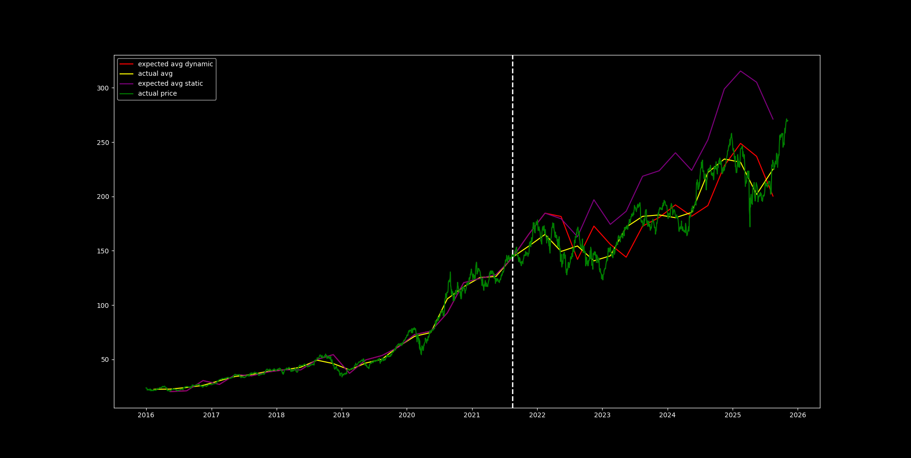

# Financial Analysis using Linear Algebra

## Overview

This project explores a simple quantitative approach to financial analysis using linear algebra.

We assume that the price of an asset is influenced by its fundamental data, and we model this relationship as **linear**.

<!--  -->
---

## Model Assumption

We assume that the price at time \( i \), denoted as \( p_i \), can be expressed as a linear combination of:

- the previous price \( p_{i-1} \)
- a set of fundamental features \( f_1, ..., f_n \)

\[
p_i = w_0 \cdot p_{i-1} + w_1 \cdot f_{i,1} + \dots + w_n \cdot f_{i,n}
\]

In vector form:

\[
p_i = \vec{f_i} \cdot \vec{w}
\]

where:

\[
\vec{f_i} = \begin{bmatrix} p_{i-1} & f_{i,1} & \dots & f_{i,n} \end{bmatrix}
\quad
\vec{w} = \begin{bmatrix} w_0 \\ w_1 \\ \dots \\ w_n \end{bmatrix}
\]

---

## Building the Linear System

By stacking multiple observations, we obtain a linear system:

\[
A \cdot \vec{w} = \vec{p}
\]

where:

\[
A =
\begin{bmatrix}
p_0 & f_{1,1} & \dots & f_{1,n} \\
p_1 & f_{2,1} & \dots & f_{2,n} \\
\vdots & \vdots & \ddots & \vdots \\
p_{k-1} & f_{k,1} & \dots & f_{k,n}
\end{bmatrix}
\quad
\vec{p} =
\begin{bmatrix}
p_1 \\
p_2 \\
\vdots \\
p_k
\end{bmatrix}
\]

We solve this system  to estimate the weight vector \( \vec{w} \).

---

## Data Assumptions

- Fundamental data is available every 3–4 months
- The dataset includes multiple assets starting from 01/01/2015
- The price at index \( i \) is approximated as the average price between two fundamental data releases

---

## Training Strategy

Two approaches are implemented:

### 1. Fixed Weights
- Compute weights using a fixed window of size `off`
- Use the same weights for future predictions

### 2. Rolling Weights
- Recompute weights at each step using updated data
- Allows adaptation to changing market conditions

---

## Plot Usage

```python
import matplotlib.pyplot as plt
import tickers
from plot import plot

plt.style.use("dark_background")

if __name__ == "__main__":
    plot(0, 22, tickers.AAPL)
```